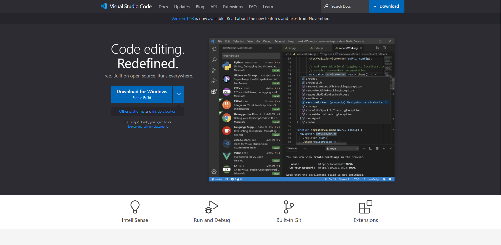
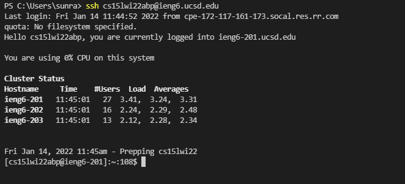
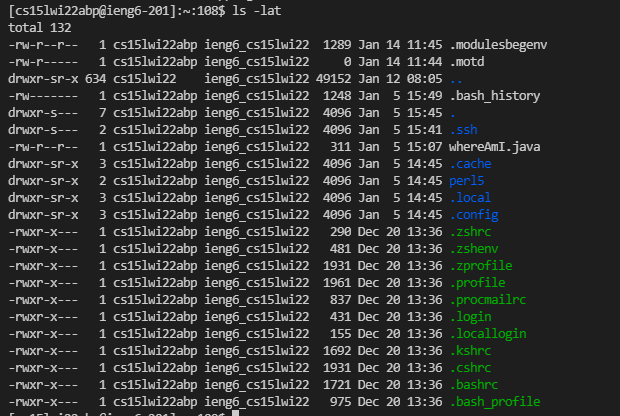
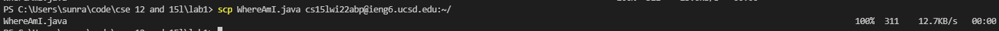
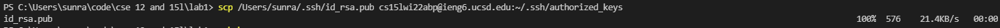
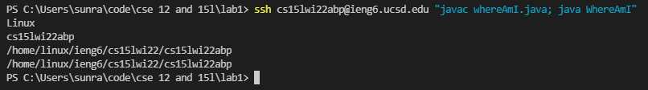

# CSE15L Week 2 Lab 1

## Installing VSCode
Go to the [Visual Studio Code website](https://code.visualstudio.com/) and download the installer for your system. Run the installer and follow all the directions.




## Remotely Connecting
If you don't already have it, [install OpenSSH](https://docs.microsoft.com/en-us/windows-server/administration/openssh/openssh_install_firstuse). 

To connect, open a terminal and type `ssh cs15lwi22zzz@ieng6.ucsd.edu` (where the zzz is the letters specific to your account). Say yes if it asks about a fingerprint and type in your password when prompted.

You should see output similar to this:




## Trying Some Commands
Here are some common commands:
* cd (change directory)
* ls (list)
* cp (copy)
* cat (concantenate; useful for printing)

The command `ls -lat` lists files, including hidden files, and lots of information about each one.



## Moving Files with ```scp```

`scp` stands for secure copy and can move files between your own pc and the lab computer. The syntax is `scp [source] [destination]`. To copy a file called *WhereAmI.java* to the home directory of your lab account, use `scp WhereAmI.java cs15lwi22abp@ieng6.ucsd.edu:~/`.



## Setting an SSH Key

Setting an SSH key allows you to ssh and scp without typing your password every time.

First, generate an SSH key on your computer by running `ssh-keygen` in a terminal. If you're on Windows, you'll have to follow additional `ssh-add` steps [here](https://docs.microsoft.com/en-us/windows-server/administration/openssh/openssh_keymanagement#user-key-generation).

Next, copy the generated `id_rsa.pub` file into `~/.ssh/authorized_keys` in your lab account (you might need to create the directory first).



## Optimizing Remote Running

If you just want to run a couple commands on the remote server, you can add them as an argument to the `ssh` command as shown below (separated by semicolons if necessary). This will log in, run the commands, then exit.
