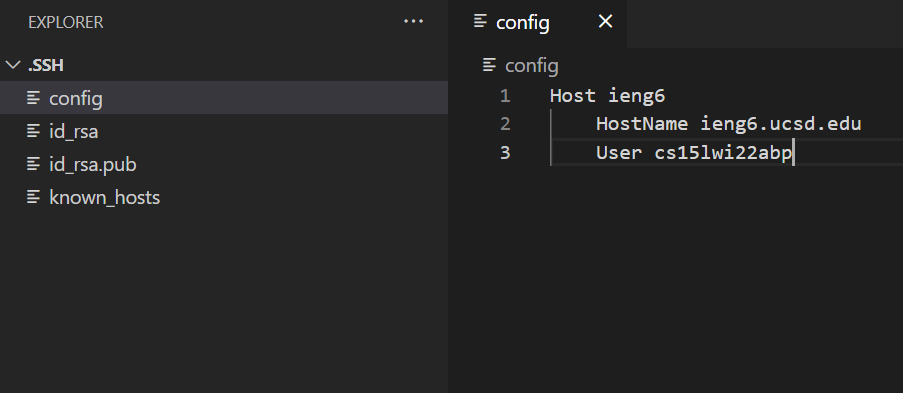
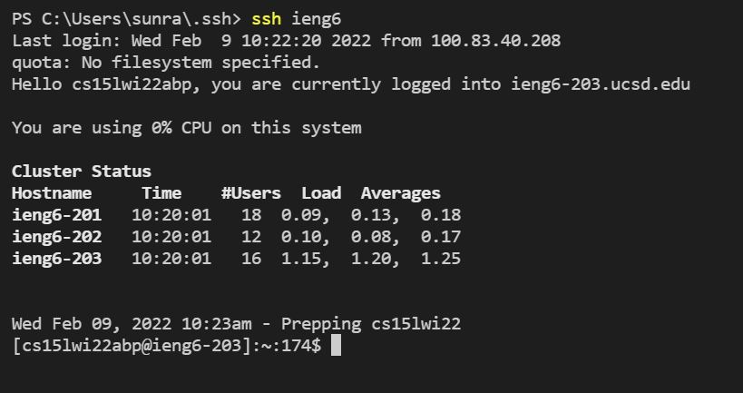
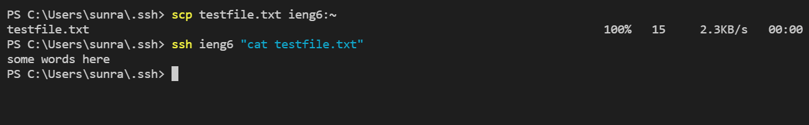

# Week 6 Lab 3

## Streamlining ssh Configuration

To avoid typing the server and username every time while `ssh`ing, create an entry in your `\user\.ssh\config` file like shown below. This allows you to specify what server and username you want to log into with just a nickname.

As shown in the picture below, all you have type is `ssh <your alias>`. 

Setting the config setting allows you to `scp` easily as well. The image below shows how you can both `scp` a file onto ieng6 and then `ssh` to check it with just the alias.

